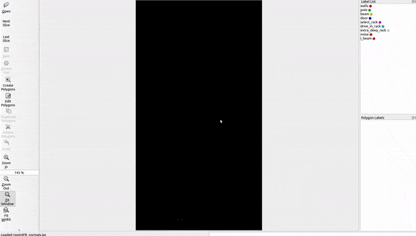
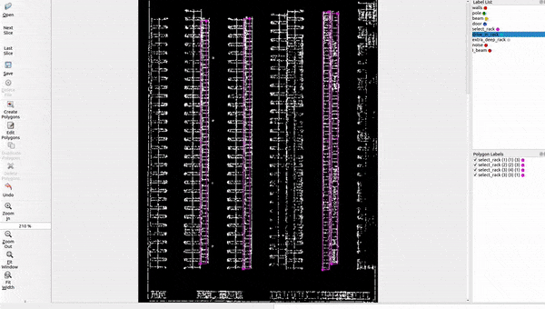

## Acknowledgement

This repo was originally copied from [wkentaro/labelme](https://github.com/wkentaro/labelme.git) 
and modified to be used as a 3D point cloud annotation tool instead of an image annotation tool.

## Demonstration

A short demonstration video can be viewed [here](https://youtu.be/jpjvWzdVLkk).
Below are some short clips from the demo video.

This GIF shows the user scrolling up and down through horizontal slices of the data.

This GIF shows the user annotating racks and poles in the point cloud.

This GIF shows the user checking the quality of the 2D annotations by looking at the 3D cloud.

## Installation

First, you can install the requirements by running `pip install -r requirements.txt`.
You can install labelpc with `pip install -e .` after installing the requirements.

Once installed, open the program by running `labelpc` in a terminal.
